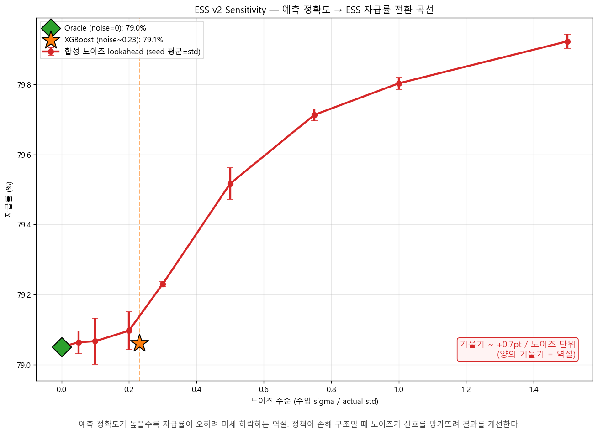

# 태양광 발전량 예측 + ESS 운영 가치 분석

전국 17개 시도의 시간별 태양광 발전량을 예측하고, 그 예측이 ESS(에너지 저장
시스템) 운영에 실제로 얼마나 가치를 만드는지 측정한 ML 시스템입니다.

**일반적 ML 프로젝트가 "예측 정확도(MAE)"에서 끝나는 것과 달리, 본 프로젝트는
정확도가 다운스트림 운영 가치로 전환되는지를 검증했습니다.**

---

## TL;DR — 핵심 발견

본 프로젝트의 가장 큰 결과는 모델 성능 수치가 아닌, **모델 정확도와 운영 가치가
구조적으로 분리될 수 있다**는 발견입니다.

1. **모델 성능 (Phase 1)**
   XGBoost 통합 모델로 전국 MAE 9.61 달성 (Naive 대비 +55.8%)

2. **운영 가치 측정 (Phase 1)**
   ESS 시뮬레이션에서 lookahead 정책이 naive보다 자급률 **−1.4pt 악화**.
   Oracle(완벽 예측)조차 같은 결과.

3. **Sensitivity 분석 (Phase 1)**
   예측 노이즈 0~150% 변화에도 자급률 곡선이 평평하거나 **음의 기울기**
   (정확도가 높을수록 미세하게 손해).

4. **원인 분석 (Phase 1)**
   그리디 시뮬 구조에서는 SOC 범위를 좁히는 어떤 정책도 손해.
   진짜 예측 가치 실현엔 **MPC(Model Predictive Control)** 필요.

5. **결론**
   "예측 정확도 향상이 운영 가치로 자동 전환되지 않는다"를 27개 시뮬 점으로
   정량 입증. 다음 단계는 모델 개선이 아닌 시스템 개선.



*예측 정확도(노이즈) 변화에도 자급률 곡선이 평평하거나 음의 기울기를 보이는 역설.
정책이 손해 구조일 때 노이즈가 신호를 망가뜨려 결과를 개선한다.*

---

## 프로젝트 구조 — Phase 1 / Phase 2

### Phase 1: 예측 + 운영 가치 측정 (완료)

| 단계 | 산출물 |
|---|---|
| 데이터 전처리 | 17개 시도 시간별 발전량 + 기상 통합 |
| 피처 엔지니어링 | lag, rolling, 기상 변수, region encoding |
| 모델 학습 | Naive · XGBoost · LSTM (3종) |
| 행동 테스트 | NaN/Inf · 방향성 · 불변성 · 정확성 검증 |
| ESS 시뮬 v2 | 4 정책 × 17 지역 × 새 지표 4종 |
| Sensitivity | 9 노이즈 × 3 seed = 27 점 |
| 최종 리포트 | `outputs/national_final_report_v2.md` |

### Phase 2: MPC 도입 (계획)

본 프로젝트에서 발견한 한계를 해결하기 위한 후속 단계입니다.

- **접근**: rolling horizon LP (매 시점 N시간 앞 보고 최적화)
- **도구 후보**: cvxpy, pyomo, stable-baselines3
- **검증 가설**: Oracle MPC > XGBoost MPC > naive 의 명확한 순서 확인
- **예상 작업량**: 2~3주

---

## 모델 성능 (Phase 1)

2023년 테스트셋, 전국 17개 시도 가중 평균 기준:

| 모델 | MAE | RMSE | 피크 MAE | Naive 대비 |
|------|-----|------|----------|-----------|
| Naive (lag1) | 21.74 | 67.03 | 30.85 | — |
| **XGBoost (통합)** | **9.61** | **46.90** | **7.87** | **+55.8%** |
| LSTM (통합) | 17.82 | 67.50 | 30.71 | +18.0% |

> XGBoost가 모든 지표에서 우수해 후속 ESS 분석은 XGBoost 단일 모델로 진행.
> LSTM은 통합 시계열 학습의 한계로 채택 보류.
> 전라남도(MAE 90.04)는 발전 규모가 커 절대 오차가 큼 — 별도 분석 대상.

---

## ESS 시뮬레이션 결과 (Phase 1)

가중 평균 기준 4 시나리오 비교:

| 시나리오 | 자가소비율 | 자급률 | 평균 부족 | 사이클수 |
|---|---|---|---|---|
| naive_baseline | 68.2% | **75.9%** | 89.3 MWh | 128.3 |
| xgb_no_lookahead | 68.2% | 75.9% | 89.3 MWh | 128.3 |
| xgb_lookahead | 66.7% | 74.5% | 90.3 MWh | 119.1 |
| oracle (완벽 예측) | 66.4% | 74.2% | 90.3 MWh | 117.7 |

**해석**: 그리디 시뮬레이터는 매 시점 SOC 범위 안에서 탐욕적 최대 충방전을
수행합니다. 이 구조에서는 SOC 범위 전체(0.20–0.80)를 활용하는 naive가
이미 탐욕 최적입니다. lookahead 정책은 SOC 범위를 좁히기만 하므로 손해를
보며, Oracle도 같은 정책 구조라 마찬가지입니다.

자세한 분석은 [`outputs/national_final_report_v2.md`](outputs/national_final_report_v2.md) 참고.

---

## 의사결정 흔적 (Decision Log)

본 프로젝트의 가치는 결과 숫자가 아닌, 매 분기점에서 내린 판단입니다.

### ESS 평가 목표: (A) 학술 비교용
실제 운영값 추정(B)이 아닌 **모델 간 통제 비교**로 의도적 포지셔닝. 외부 데이터
도입 최소화, 환경 단순화 명시.

### 울산시 노이즈 격리 (G-1)
발견: 발전 비중 0.02%, ESS 용량 1.4 MWh → 수치 안정성 위험
결정: 임계 weight=0.001 도입, 단순 평균에서만 격리(17개 vs 16개 병기)
이유: 임의 제외는 일관성 원칙에 위배. 격리 + 두 기준 병기로 정직성 확보.

### 역전 현상 발견 후 정책 재설계 거부 (G-4)
발견: lookahead/oracle이 naive보다 못한 결과
결정: 정직한 수용. 정책 재설계 거부.
이유: 결과를 "맞게" 만드는 것은 (B) 방향. (A)는 결과의 의미를 정확히 해석하는 것.
   역전 자체가 "MAE ≠ ESS 점수" 가설의 정량 증거.

### MPC 도입 후속 분리
발견: 진짜 예측 가치 실현엔 MPC 필요
결정: 본 프로젝트 범위에서 제외, Phase 2로 분리
이유: 작업량 2~3주 추가 → 발견 메시지 희석. Phase 분리가 포트폴리오 가치 ↑.

---

## 데이터

- **출처**: 기상청 ASOS 시간별 관측 + 한국전력거래소 지역별 시간별 태양광 발전량
- **기간**: 2017~2023년
- **분리**: 시간 순 (train ≤ 2022년 / test = 2023년)

> 원본 데이터(`data/`)와 학습된 모델 가중치(`models/`)는 용량 문제로 저장소에
> 포함되지 않습니다. 전처리 스크립트로 재생성하거나 별도로 받아야 합니다.

---

## 프로젝트 디렉토리

```
.
├── preprocess_national.py        # 원본 → 학습용 데이터 전처리
├── src/
│   ├── features/                 # 피처 엔지니어링
│   ├── models/                   # Baseline / XGBoost / LSTM 학습
│   ├── simulation/               # ESS 시뮬레이션 (v1, v2)
│   │   ├── ess_config_v2.py      # 파라미터 모듈
│   │   ├── ess_policy_v2.py      # 정책 함수 5종
│   │   ├── ess_simulation_v2.py  # 시뮬 본체 (Phase 1 핵심)
│   │   └── ess_sensitivity_v2.py # sensitivity 분석
│   ├── diagnostics/              # 데이터 진단 / 분포 변화 점검
│   ├── reporting/                # 지표 산출 / 최종 보고서 생성
│   ├── tests/                    # 행동 테스트
│   ├── visualization/            # 비교 그래프
│   └── utils/                    # 한글 폰트 설정 등
├── outputs/                      # 평가 결과 (json / csv / png / 보고서)
│   ├── national_final_report_v2.md    # ← 최종 리포트
│   ├── ess_v2_sensitivity_curve.png   # ← 시그니처 시각화
│   └── ...
├── archive/                      # 종료된 실험 기록
├── eda/                          # 탐색적 데이터 분석
└── requirements.txt
```

---

## 설치 및 실행

Python 3.11 기준입니다.

```bash
# 가상환경 생성 및 의존성 설치
python -m venv .venv
.venv\Scripts\activate        # Windows
pip install -r requirements.txt
```

데이터를 `data/raw/`에 배치한 뒤 파이프라인을 순서대로 실행:

```bash
# 1. 전처리
python preprocess_national.py

# 2. 피처 엔지니어링
python src/features/feature_engineering_national.py

# 3. 모델 학습
python src/models/baseline_naive_national.py
python src/models/train_xgboost_national.py
python src/models/train_lstm_national.py

# 4. ESS 시뮬레이션 v2 (Phase 1 핵심)
python -m src.simulation.ess_config_v2
python -m src.simulation.ess_policy_v2
python -m src.simulation.ess_simulation_v2
python -m src.simulation.ess_sensitivity_v2

# 5. 최종 리포트
python -m src.reporting.final_report_v2
```

---

## 모델링 규칙

재현성과 데이터 누수 방지를 위해 다음을 강제합니다:

- **시간 순 분리**: train ≤ 2022년, test = 2023년. random split 금지.
- **데이터 누수 금지**: scaler·LabelEncoder는 train 기준으로만 fit.
- **재현성**: `random_state=42` 고정. sensitivity는 [42, 123, 456] 다중 seed.
- **야간 클리핑**: 00~05시, 19~23시 예측값은 0으로 클리핑.
- **인코딩**: CSV 입출력은 `utf-8-sig` / `utf-8`.

---

## 기술 스택

pandas · numpy · scikit-learn · XGBoost · PyTorch · matplotlib · seaborn ·
statsmodels · wandb

---

## 자세한 분석

전체 분석과 시각화는 [`outputs/national_final_report_v2.md`](outputs/national_final_report_v2.md) 참고.