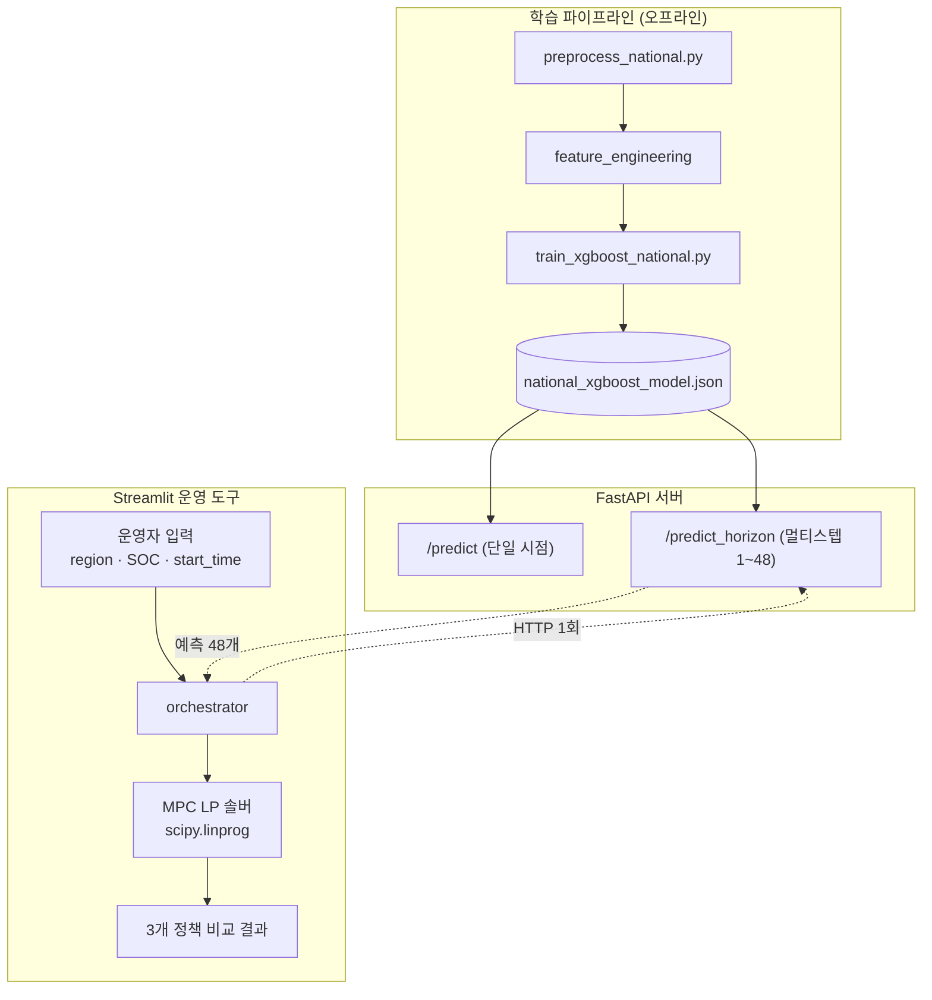
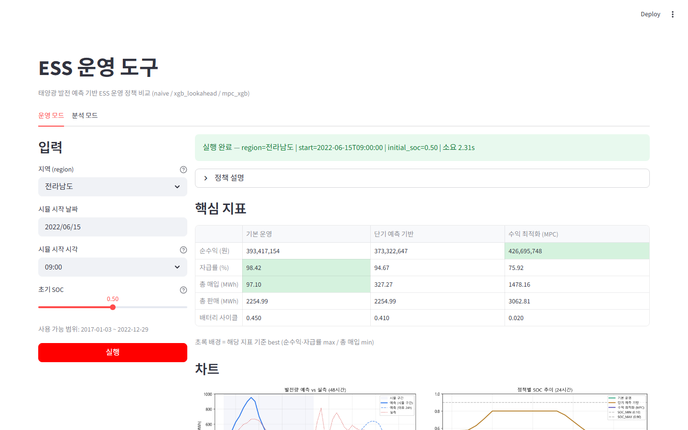

# 태양광 발전량 예측 + ESS 운영 가치 분석

> ESS 운영의 진짜 가치는 모델 정확도가 아니라 시스템 구조에 있다.
> 17지역 × 6개 정책 × 1년치 실증.

---

## 핵심 발견

**시그니처 1 — 모델 정확도의 한계 효용 ≈ 0**

- `mpc_xgb` (XGBoost MAE 9.61 예측) vs `mpc_oracle` (실측 = 완벽 예측) net_revenue 차이: **+0.08%** (national_sum 기준 2,526억원 vs 2,528억원).
- AutoGluon v1/v2 검증에서 트랜스포머 4종(TFT, PatchTST 등)을 앙상블에 추가했지만 가중치 0%.
- Phase 1 노이즈 sensitivity: 예측 정확도를 의도적으로 떨어뜨려도 자급률이 오히려 미세 개선.

**시그니처 2 — MPC가 ESS 사용 목적 자체를 바꿈**

- 기존 정책: ESS = 수요 충당 도구 / MPC: ESS = 차익거래 자산 (TOU 가격 스프레드 활용).
- `mpc_xgb` vs `xgb_lookahead`: **net_revenue +49.53% (1,689억 → 2,526억원), 자급률 −17.48pt**.
- ESS 거래량 70~80% 증가 (충·방전 사이클 수 기준).


*6개 정책 비교. MPC 도입으로 net_revenue가 +49.53% 증가하지만 자급률은 −17.48pt 떨어진다. 같은 MPC 안에서 xgb 예측과 oracle 실측의 차이는 0.08%에 불과 — 모델보다 시스템 구조가 결과를 결정함.*

---

## 발견의 흐름 — 어떻게 여기까지 왔나

### 단계 1. 모델 탐색기

- 베이스라인 Naive(lag1) 대비 XGBoost 통합 모델 MAE 9.59(약 +55.8%). LSTM은 MAE 17.82로 XGBoost의 1.9배.
- LSTM의 ESS 부족 카운트가 XGBoost보다 17% 적게 나옴 → 모델이 아니라 시뮬레이터를 의심 → **비대칭 분기 버그 발견**(예측 양수·실측 음수일 때 부족 카운트 누락).
- AutoGluon v1/v2로 재검증: 트랜스포머 4종을 추가했으나 앙상블 가중치 0%. 분리 학습은 MAE는 악화·ESS 점수 0% 변화로 폐기.
- **결론**: known_covariates 의존성이 큰 태양광에서는 트리 모델(XGBoost 통합)이 가장 적합.

### 단계 2. ESS 시뮬레이터 정밀화

- 17지역 차등 가중치(전남 0.301 ~ 울산 0.0002), KPX 표준 부하 곡선, 산업 통상값(0.25C 충방전, RTE 90%) 도입.
- 비대칭 버그 수정: 분기와 강도 분리("우산을 펴는 행위는 실제 비 올 때만, 예측은 우산 크기만 결정").
- 정책 함수 분리(`naive` / `lookahead` / `perfect_foresight`).
- **시그니처 1 첫 실증**: 예측 노이즈 0 → 1.5 증가 시 자급률 79.05% → 79.92% (역설).
- **결론**: 그리디 시뮬에서는 예측 정확도가 운영 가치를 거의 못 만든다.

### 단계 3. TOU 변동요금 도입

- 한전 산업용(을) 고압A 선택Ⅱ 단가 매트릭스(2023.5.16 시행본) 반영.
- 자급률 vs net_revenue가 갈리기 시작.
- `lookahead`가 의도치 않은 차익거래로 작동(SOC 상한을 낮춰 충전을 미룸 → max_peak 매도/off_peak 매수 스프레드 발생). net_revenue +약 18억원.
- **메시지**: 같은 데이터에서 평가 지표만 바꿔도 결론이 갈린다.

### 단계 4. MPC 도입 — 시스템 구조 자체를 바꿈

- 6개 정책 비교: `naive` / `xgb_no_lookahead` / `xgb_lookahead` / `oracle` / **`mpc_xgb`** / **`mpc_oracle`**.
- MPC 방식: 매 시점 24시간 미래 예측 → LP(`scipy.optimize.linprog`) 최적 충방전 시퀀스 → 첫 액션만 실행(Rolling Horizon).
- `mpc_xgb` vs `xgb_lookahead`: **net_revenue +49.53% / 자급률 −17.48pt**, 거래량 70~80% 증가.
- `mpc_xgb` ≈ `mpc_oracle`(차이 +0.08%) — MPC가 예측 부정확성에 robust함을 확인(시그니처 1 재확인).
- LP infeasibility ~13%는 전국 합산(`national_sum`)에서만 발생(17개 지역별 시뮬은 모두 0건) → 시뮬 한계로 보고서 명시.

### 단계 5. 운영 시스템화

- FastAPI `/predict`(단일 시점) + `/predict_horizon`(multi-step, horizon 1~48) 분리.
- 첫 Swagger 호출에서 **24-피처 불일치**(JSON 메타가 학습 코드와 어긋남) 발견 → lifespan에 `booster.feature_names == FEATURE_ORDER` 검증을 박아 fail-fast. API 한 겹이 모델 검증 장치로 작동.
- 재귀 multi-step 정당성 검증: 장기/단기 RMSE 비율 1.24 (PASS).
- Streamlit + MPC 오케스트레이터: 단일 진입점 `run_mpc_simulation()`로 3개 정책 결과 dict 반환. 운영자가 region·initial_soc·start_time만 선택하면 비교 그래프 산출.

---

## 시스템 아키텍처


```mermaid
flowchart TB
    subgraph 학습["학습 파이프라인 (오프라인)"]
        A[preprocess_national.py] --> B[feature_engineering]
        B --> C[train_xgboost_national.py]
        C --> D[(national_xgboost_model.json)]
    end

    subgraph API["FastAPI 서버"]
        D --> E["/predict (단일 시점)"]
        D --> F["/predict_horizon (멀티스텝 1~48)"]
    end

    subgraph UI["Streamlit 운영 도구"]
        G[운영자 입력<br/>region · SOC · start_time] --> H[orchestrator]
        H -. HTTP 1회 .-> F
        F -. 예측 48개 .-> H
        H --> I[MPC LP 솔버<br/>scipy.linprog]
        I --> J[3개 정책 비교 결과]
    end
```

설계 결정:

- **예측은 API로 분리** — 다른 클라이언트(모바일·모니터링)에서도 호출 가능.
- **MPC는 Streamlit 내부 구동** — 운영 파라미터 실시간 조절 시 HTTP 오버헤드 제거.
- **단일 진입점 `run_mpc_simulation()`** — 화면 로직과 시뮬 로직 명확 분리.

---

## 운영 도구



운영자가 region(17개 중 선택) + initial_soc 슬라이더 + 시작 시점만 지정하면, 24시간 구간에 대해 3개 정책(기본 운영 / 단기 예측 기반 / 수익 최적화 MPC)을 한 번에 시뮬합니다. 출력은 4종: 발전량 예측 vs 실측 / 정책별 SOC 추이 / 순수익·자급률 비교 / 시간대별 매매. 자급률 우선 운영과 수익 우선 운영을 한 화면에서 비교 가능.

---

## 기술 스택

- **모델링**: XGBoost, AutoGluon (검증용)
- **시뮬레이터**: 자체 구현 (정책 함수 분리 구조)
- **MPC**: `scipy.optimize.linprog` (LP solver)
- **API**: FastAPI, Pydantic
- **UI**: Streamlit, matplotlib
- **테스트**: pytest (단위 + 회귀 + 정합성)

---

<details>
<summary>실행 방법</summary>

Python 3.11.

```bash
python -m venv .venv
.venv\Scripts\activate          # Windows
pip install -r requirements.txt
```

### FastAPI 서버

```bash
# (선택) 운영용 API Key
set SOLAR_API_KEY=your-strong-random-key      # Windows
# export SOLAR_API_KEY=...                    # macOS/Linux

uvicorn app.main:app --host 0.0.0.0 --port 8000
```

Swagger UI: `http://localhost:8000/docs`. 미설정 시 개발용 기본키 `dev-key-change-me`로 동작하며 startup에 경고 로그 출력.

### Streamlit 운영 도구

```bash
# (FastAPI 서버를 먼저 띄운 상태에서)
streamlit run app_streamlit/app.py
```

### 전체 학습 파이프라인 재생성

```bash
python preprocess_national.py
python src/features/feature_engineering_national.py
python src/models/train_xgboost_national.py
python -m src.simulation.ess_simulation_v2
python -m src.reporting.final_report_v2
```

### 테스트

```bash
pytest app/tests/ -v                    # FastAPI 회귀 (단일+horizon)
pytest app_streamlit/tests/ -v          # 오케스트레이터 + 헬퍼 정합성
pytest src/tests/ -v                    # 모델 행동 테스트
```

</details>

<details>
<summary>디렉토리 구조</summary>

```
.
├── app/                          # FastAPI 서버
│   ├── main.py                   # /predict, /predict_horizon, /health
│   ├── schemas.py                # Pydantic 입출력
│   ├── config.py                 # FEATURE_ORDER (모델 권위 컬럼)
│   └── tests/                    # 회귀 테스트 16개
├── app_streamlit/                # Streamlit + MPC 오케스트레이터
│   ├── app.py                    # UI 엔트리
│   ├── orchestrator.py           # run_mpc_simulation() 단일 진입점
│   ├── simulator.py              # 시뮬 헬퍼 (원본 ess_simulation_v2와 정합)
│   └── tests/                    # 오케스트레이터 회귀 + 헬퍼 정합성
├── src/
│   ├── features/                 # 피처 엔지니어링
│   ├── models/                   # XGBoost / LSTM / Naive 학습
│   ├── simulation/               # ESS 시뮬 v2 + MPC (LP 포함)
│   │   ├── ess_simulation_v2.py  # 6정책 본체 (MPC 포함)
│   │   ├── ess_policy_v2.py      # 정책 함수
│   │   ├── ess_config_v2.py      # 시뮬 파라미터 모듈
│   │   └── ess_sensitivity_v2.py # 노이즈 sensitivity
│   ├── reporting/                # 최종 보고서 생성
│   ├── diagnostics/              # 분포·정확도 진단
│   └── tests/                    # 행동 테스트
├── outputs/                      # 결과 (json / csv / png / md)
├── models/                       # 학습된 가중치
├── data/                         # raw / processed (저장소 제외)
└── archive/                      # 종료된 실험 기록
```

</details>

<details>
<summary>모델 탐색 상세 — AutoGluon v1/v2, LSTM 등</summary>

### XGBoost vs LSTM (전국 가중 평균, 2023년 테스트셋)

| 모델 | MAE | RMSE | 피크 MAE | Naive 대비 |
|------|-----|------|----------|-----------|
| Naive (lag1) | 21.74 | 67.03 | 30.85 | — |
| **XGBoost 통합** | **9.61** | **46.90** | **7.87** | **+55.8%** |
| LSTM 통합 | 17.82 | 67.50 | 30.71 | +18.0% |

### AutoGluon v1 / v2 검증

- v1: 17개 base learner 앙상블. XGBoost 단독 대비 통계적 유의 차 없음.
- v2: TFT, PatchTST 등 트랜스포머 계열 4개 추가 → **앙상블 가중치 0%**. known_covariates 의존성이 큰 단기 태양광 예측에서는 트리가 우위.
- 시각화: `outputs/autogluon/autogluon_v2/autogluon_v2_leaderboard.png`, `autogluon_v2_vs_xgb_region.png`.

### 분리 학습 실험 (전남 단독)

- 가설: 발전 규모가 큰 전남(MAE 90+)을 분리하면 통합 모델 MAE 개선
- 결과: 통합 모델 MAE는 악화, ESS 점수는 변화 0% → 폐기
- 기록: `archive/split_learning_experiment/`, `archive/jeonnam_v1_log1p_weighted/`

</details>

<details>
<summary>핵심 발견 상세 — MAE ≠ ESS 점수, 비대칭 버그 추적</summary>

### LSTM vs XGBoost 비대칭 버그 추적

LSTM의 ESS 부족 카운트가 XGBoost보다 17% 적게 나오는데, 이게 LSTM이 "더 잘해서"인지 의심해서 시뮬레이터를 뜯어봄. 결국 **분기와 강도가 같은 변수에 묶여 있던 버그** 발견:

- 기존: 예측 양수·실측 음수면 충전 시도 → 실패 시 부족 카운트 누락
- 수정: 분기(`if predict > 0`)와 강도(`abs(predict)`)를 분리. "우산을 펴는 행위는 실제 비 올 때만, 예측은 우산 크기만 결정."

### Phase 1 sensitivity 곡선

`outputs/ess_v2_sensitivity_curve.png`. 예측 노이즈 0→1.5x 변화에 자급률이 평평~음의 기울기. 정확도가 운영 가치로 자동 전환되지 않음을 27개 시뮬 점으로 정량 입증.

### Phase 1 4정책 비교 (그리디 시뮬, MPC 도입 전)

| 시나리오 | 자가소비율 | 자급률 | 평균 부족 | 사이클수 |
|---|---|---|---|---|
| naive_baseline | 68.2% | **75.9%** | 89.3 MWh | 128.3 |
| xgb_no_lookahead | 68.2% | 75.9% | 89.3 MWh | 128.3 |
| xgb_lookahead | 66.7% | 74.5% | 90.3 MWh | 119.1 |
| oracle (완벽 예측) | 66.4% | 74.2% | 90.3 MWh | 117.7 |

이 표 자체가 시그니처 1의 출발점: oracle도 naive보다 못함 → 정책 구조가 결과를 결정함.

</details>

<details>
<summary>FastAPI 호출 예시 — /predict, /predict_horizon</summary>

### `/predict` (단일 시점)

```python
import requests

payload = {
    "timestamp": "2023-07-15T13:00:00",
    "region": "전라남도",
    "기온": 28.5, "강수량": 0.0, "습도": 65.0, "일조": 0.9,
    "irradiance": 3.0, "전운량": 2.0,
    "lag_1h": 120.0, "lag_2h": 110.0, "lag_3h": 95.0, "lag_24h": 130.0,
    "power_diff_1h": 10.0, "power_diff_2h": 25.0,
    "rolling_mean_3h": 108.3, "rolling_mean_6h": 95.5, "rolling_std_3h": 12.7,
}
r = requests.post(
    "http://localhost:8000/predict",
    headers={"X-API-Key": "dev-key-change-me"},
    json=payload,
)
# 200 {'predicted_power_mwh': 129.23..., 'region': '전라남도', ...}
```

### `/predict_horizon` (multi-step 1~48)

```python
from datetime import datetime, timedelta
start = datetime(2023, 7, 15, 13, 0, 0)
history = [
    {"timestamp": (start - timedelta(hours=24-i)).isoformat(),
     "power_mwh": 100.0 + i}
    for i in range(24)
]
forecast = [
    {"timestamp": (start + timedelta(hours=i)).isoformat(),
     "irradiance": 2.5, "기온": 28.0, "강수량": 0.0,
     "습도": 60.0, "일조": 0.8, "전운량": 3.0}
    for i in range(24)
]
r = requests.post(
    "http://localhost:8000/predict_horizon",
    headers={"X-API-Key": "dev-key-change-me"},
    json={"region": "전라남도", "start_time": start.isoformat(),
          "horizon": 24, "history": history, "forecast": forecast},
)
# 200, predictions: 길이 24 [{timestamp, predicted_power_mwh, step}, ...]
```

`requests`/urllib 권장. curl `@file`은 일부 환경에서 chunked transfer로 검증 오류 경로가 400이 될 수 있음.

회귀 테스트: `pytest app/tests/test_api.py -v` (16개). 특히 `test_predict_snapshot`은 학습 CSV에서 5행 샘플링 → raw `model.predict()`와 API 결과를 `|diff| < 1e-4`로 검증.

</details>

<details>
<summary>운영 모니터링 회고 — 실서비스에 추가했을 항목</summary>

본 프로젝트는 포트폴리오 범위라 실제 모니터링 인프라는 미구성. 실배포 시 추가했을 항목:

- **응답 시간 p95/p99** — `RequestLoggingMiddleware`의 ms 로그를 Prometheus histogram으로 승격
- **예측 분포 드리프트** — 일별 `predicted_power_mwh` 분포를 학습 시점과 KS-test/PSI로 비교
- **입력 피처 분포 드리프트** — 기상 6변수(기온/강수량/습도/일조/일사량/전운량)의 평균·분산 감시
- **`feature_names` 검증 실패 알림** — lifespan의 `booster.feature_names == FEATURE_ORDER` 체크를 CI에서도 동일 실행

### 본 단계에서 학습한 교훈

**모델 입출력 명세의 진실의 원천은 학습 스크립트와 모델 파일이지, 별도 JSON 문서(`feature_list_national.json`)가 아니다.** 운영 시스템화 단계에서 모델은 24개 피처를 기대했는데 JSON은 18개만 명시 — 학습 코드의 `train.columns - NON_FEAT` 산출만이 권위. `app/config.py::FEATURE_ORDER`는 이 사실을 코드에 박은 결과이며 lifespan에서 동일성 검증으로 재발 방지.

</details>

<details>
<summary>데이터 · 모델링 규칙</summary>

- **출처**: 기상청 ASOS 시간별 + 한국전력거래소 지역별 시간별 태양광 발전량
- **기간**: 2017~2023
- **분리**: 시간 순 (train ≤ 2022, test = 2023). random split 금지.
- **누수 금지**: scaler·LabelEncoder는 train 기준으로만 fit.
- **재현성**: `random_state=42`. sensitivity는 [42, 123, 456] 다중 seed.
- **야간 클리핑**: 00~05시, 19~23시 예측값 = 0.
- **인코딩**: CSV `utf-8-sig` / `utf-8`.

원본 데이터(`data/`)와 학습된 모델 가중치(`models/`)는 용량 문제로 저장소 제외. 전처리 스크립트로 재생성 또는 별도 수령.

</details>

---

자세한 분석은 [`outputs/national_final_report_v2.md`](outputs/national_final_report_v2.md) 참고.
