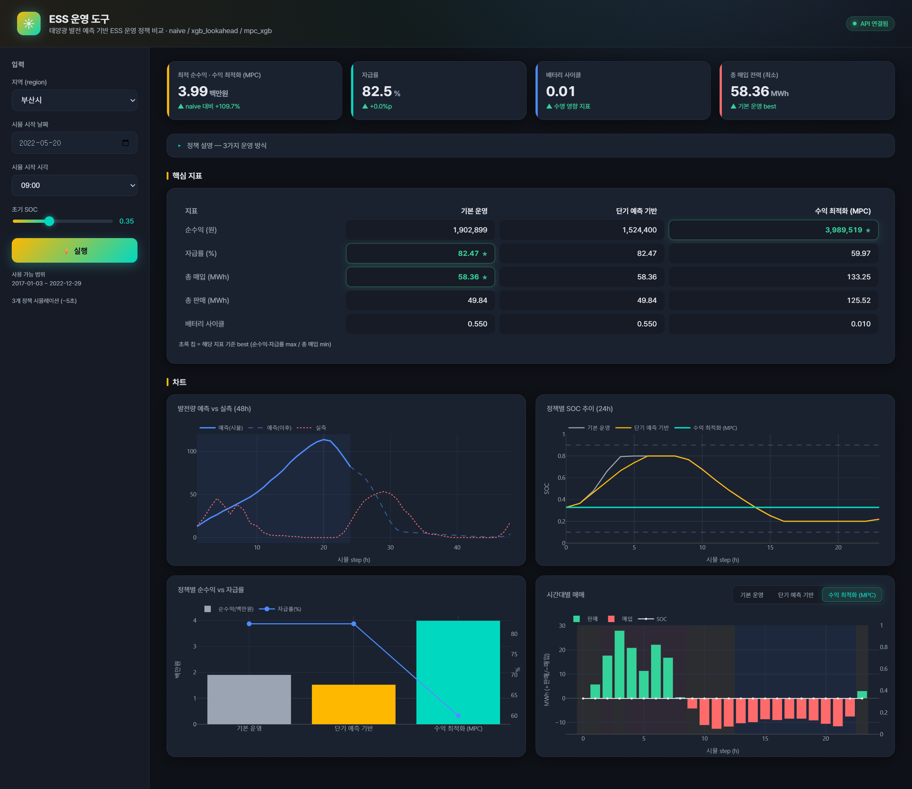
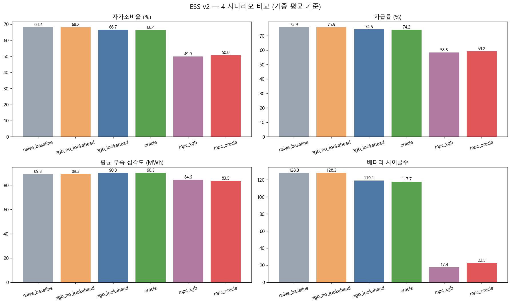
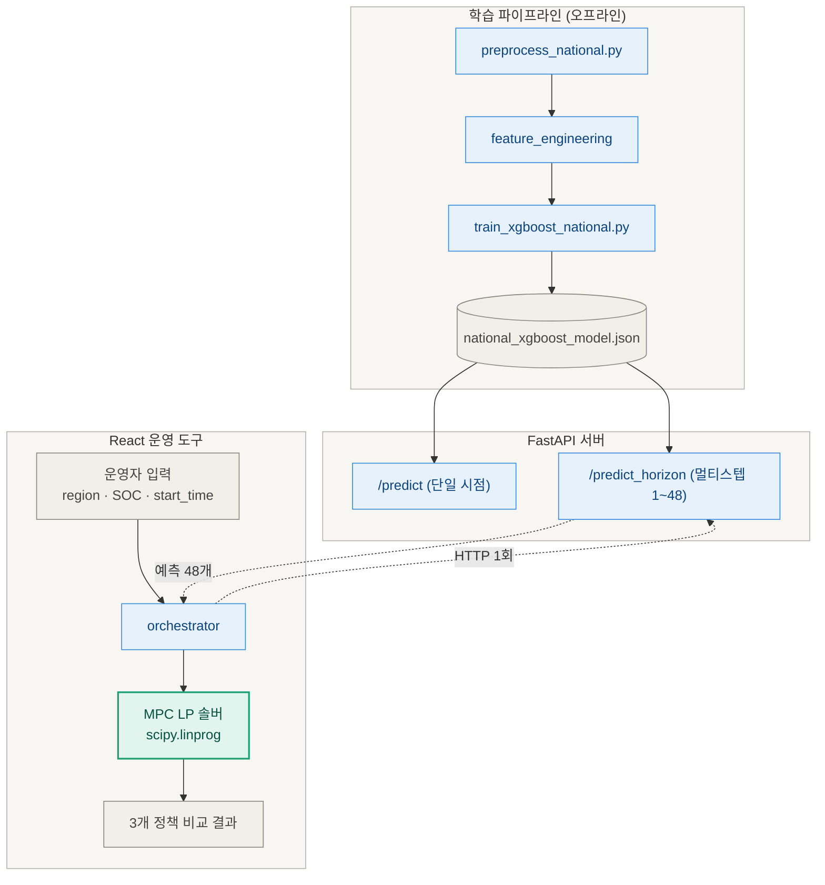

# ☀️ 태양광 발전량 예측 + ESS 운영 가치 분석

전국 17개 시도의 시간별 태양광 발전량을 예측하고, 그 예측으로 ESS(에너지저장장치)를
언제 충전하고 언제 방전해야 수익이 나는지까지 1년치 데이터로 시뮬레이션한 프로젝트입니다.

태양광과 ESS를 공부하면서, **"발전량을 정확히 예측하는 것"과 "그 예측이 실제 운영 수익을 만드는 것"은 완전히 다른 문제**라는 사실을 이 프로젝트에서 제일 크게 배웠습니다.

`Python 3.11` · `XGBoost` · `FastAPI` · `Streamlit` · `scipy (LP·MPC)` · `AutoGluon` · `pytest`

---

## 주요 화면

**운영 도구** : 운영자가 지역, SOC, 시작 시점만 고르면 24시간 구간을 3개 정책(기본 운영 / 단기 예측 / 수익 최적화 MPC)으로 한 번에 시뮬하고 핵심 지표, 발전량 예측, 정책별 SOC, 시간대별 매매를 한 화면에서 비교합니다.

<p align="center">
  
</p>

## 만든 이유
평소 에너지테크, 기후테크처럼 자연과 지구를 위한 기술에 관심이 많았습니다. 그 분야를 더 깊이 알고 싶어 프로젝트 주제를 고민하다, **태양광 에너지를 어떻게 수익으로 바꾸는가**에 호기심을 가지게 되었습니다.

관련 자료를 살펴보면 '발전량 예측을 잘하면 ESS 운영도 좋아진다'는 말이 당연하게 받아들여지는데, 정작 예측 정확도가 정말 운영 수익으로 얼마나 이어지는지는 직접 재본 적이 없다는 걸 알게 됐습니다. 그래서 전국 태양광 데이터로 모델을 만들고, 그 예측을 실제 ESS 운영에 넣어 2023년 1년치 데이터를 처음부터 끝까지 돌려보기로 했습니다.
만들다 보니 진짜 어려운 건 모델을 더 정확하게 만드는 것이 아니라, "정확도가 정말 가치를 만드는지 의구심을 가지고 측정하는 것"이었습니다.

## 가장 신경 쓴 것

여러 모델과 운영 방식을 비교하면서 그 결과를 제가 보고 싶은 대로 만들지 않는 것을 가장 중요하게 여겼습니다.

한번은 LSTM이 XGBoost보다 ESS 부족(전력이 모자란) 횟수가 17% 적게 나왔습니다. 수치 상으로 보면 "LSTM이 더 좋네"라고 넘어갈 수도 있었지만, 모델을 칭찬하는 대신 시뮬레이터를 먼저 의심했습니다. 확인해보니 모델은 미래에 발전량이 있을 것이라 예측했는데 실제로는 전력이 모자랐던 상황에서 시뮬레이터가 그 부족분을 세지 않고 넘어가는 버그가 있었습니다. 

즉, LSTM의 부족 횟수가 적게 나온 건 더 잘해서가 아니라 시뮬레이터가 일부 부족 상황을 빠뜨려 만든 착시였습니다. 고칠 때는 '실제로 충방전할지'는 진짜 상황을 보고 정하고, 모델 예측은 '배터리를 얼마나 쓸지' 크기만 정하도록 로직을 나눴습니다.

그리고 데이터가 시계열이라는 점을 고려해, 학습과 평가를 시간 순서대로 나눴습니다. 스케일러도 train 기준으로만 맞춰 미래 정보가 새지 않게 했습니다.

전국 합산 시뮬에서 MPC가 약 13% 구간에서 조건(배터리 용량, 충방전 한계, 수요 충족 등)을 동시에 만족하는 운영 계획이 아예 없어 해를 못 찾은 것(LP infeasibility)도 숨기지 않고 보고서(`outputs/national_final_report_v2.md`)에 기록해 두었습니다.

## 가장 많이 배운 것

처음엔 모델을 더 정교하게 만들면 운영 가치가 올라갈 거라 생각했습니다. AutoGluon으로 17개 모델을 앙상블해 보고, TFT와 PatchTST 같은 트랜스포머 4종도 추가해 봤습니다. 발전 규모가 압도적으로 큰 전남이 통합 모델의 오차를 키운다고 보고 전남만 따로 떼어 학습하면 전체 성능이 좋아질지도 실험했습니다.

측정해보니 거의 전부 효과가 없었습니다. 트랜스포머는 앙상블 가중치 0%, 전남 분리 학습은 ESS 점수 변화 0%. 심지어 예측에 일부러 노이즈를 넣어 정확도를 떨어뜨렸을 때 자급률은 79.05% → 79.92%로 오히려 미세하게 올랐습니다. 예측 정확도를 아무리 높여도 안 풀리는 영역이 있다는 것을 확인한 순간이었습니다.

배터리를 굴리는 '운영 방식'도 한 번에 만든 게 아니라 단계적으로 발전시켰습니다.

1. **기본 운영(naive)** — 예측을 아예 쓰지 않습니다. 그 순간 발전량이 남으면 충전, 모자라면 방전. 눈앞 상황에만 반응합니다.
2. **단기 예측 기반(lookahead)** — XGBoost 예측으로 '곧 발전량이 늘겠다/줄겠다'를 보고 충방전 시점을 조금 미리 조정합니다.
3. **완벽 예측(oracle)** — 2023년 실제 발전량을 미리 다 안다고 가정하고 운영합니다. 모델이 아니라 정답지를 미리 본 셈으로, 예측이 완벽할 때 최대로 얼마나 좋아지는지를 보는 상한선입니다.

그런데 이 셋은 전부 '남으면 충전, 모자라면 방전'이라는 **같은 규칙** 안에서 예측만 더 정확해진 것이었습니다. 그래서 정답지로 예측하는 oracle조차 기본 운영보다 거의 나아지지 않았습니다. 규칙이 같으면 예측을 아무리 잘해도 결과가 비슷했던 겁니다.

그래서 모델을 더 깎는 대신, 매 시점 앞으로 24시간을 내다보고 언제 얼마나 충방전할지를 통째로 계산해 실행하는 **MPC(수익 최적화)** 방식으로 규칙 자체를 바꿨습니다.

그 결과, 같은 예측에 같은 데이터인데도 **순수익이 +49.5% 올랐습니다**(1,689억 → 2,526억원). 반대로 이 MPC에 넣는 예측을, XGBoost 모델이 아닌 완벽한 예측인 oracle(=2023년 실제값)으로 바꿔도 수익은 +0.08%밖에 늘지 않았습니다. **결과를 가른 건 모델 정확도가 아니라 운영 방식(시스템 구조)이었습니다.**

이 과정에서 익숙한 지표(정확도)를 끝까지 끌어올리는 게 늘 정답은 아니라는 걸 체감했습니다. 숫자로 한계가 확인됐을 때, 정확도를 더 세게 밀어붙이기보다 운영 구조라는 다른 축으로 갈아타는 판단이 결과를 바꿨습니다.



*6개 정책 비교. MPC 도입으로 순수익이 +49.53% 오르지만 자급률은 −17.48pt 떨어진다. 같은 MPC 안에서 xgb 예측과 oracle 실측의 차이는 0.08%에 불과 — 모델보다 시스템 구조가 결과를 결정한다.*

<details>
<summary>용어 정리 (예측 정확도, 운영 가치, 자급률, 순수익)</summary>

- **예측 정확도** : 모델이 시간별 발전량을 얼마나 잘 맞혔는지. 오차가 작을수록 좋음, 흔히 말하는 loss를 줄이는 것을 말함.
- **운영 가치** : 그 예측을 보고 배터리(ESS)를 잘 굴려 실제로 얼마나 이득을 봤는지.
- **자급률** : 외부 전력망에서 전기를 사 오지 않고 태양광+배터리만으로 수요를 채운 비율
- **순수익** : 태양광 잉여를 계통에 판 매도 수익에서, 모자란 전력을 계통에서 사 온 매수 비용을 뺀 금액(매도 - 매수). 시간대별 요금이 다르므로 잉여를 언제 팔고 부족분을 언제 사느냐가 순수익을 가름.

</details>

<details>
<summary>MPC가 동작하는 원리</summary>

매 시간마다 앞으로 24시간 예측을 펼쳐 놓고 '이 24시간 동안 언제 얼마나 충방전하면 수익이 가장 큰지'를 수학 최적화(LP, `scipy.optimize.linprog`)로 한 번에 계산합니다. 그 계획에서 딱 첫 1시간만 실행하고, 한 시간 뒤 새 정보로 다시 계산합니다. 눈앞에 반응하는 게 아니라 미리 내다보고 판을 짜는 방식입니다.

</details>

## 동작 방식

먼저 아키텍처 전체 흐름은 이렇습니다.


```mermaid
flowchart TB
    subgraph TRAIN["학습 파이프라인 (오프라인)"]
        A[preprocess_national.py] --> B[feature_engineering]
        B --> C[train_xgboost_national.py]
        C --> D[(national_xgboost_model.json)]
    end

    subgraph API["FastAPI 서버"]
        D --> E["/predict (단일 시점)"]
        D --> F["/predict_horizon (멀티스텝 1~48)"]
    end

    subgraph UI["React 운영 도구"]
        G[운영자 입력<br/>region · SOC · start_time] --> H[orchestrator]
        H -. HTTP 1회 .-> F
        F -. 예측 48개 .-> H
        H --> I[MPC LP 솔버<br/>scipy.linprog]
        I --> J[3개 정책 비교 결과]
    end

    classDef io fill:#F1EFE8,stroke:#888780,color:#444441
    classDef proc fill:#E6F1FB,stroke:#378ADD,color:#0C447C
    classDef gate fill:#E1F5EE,stroke:#1D9E75,color:#085041,stroke-width:2px

    class A,B,C,E,F,H proc
    class D,G,J io
    class I gate

    style TRAIN fill:#F7F6F2,stroke:#B4B2A9
    style API fill:#F7F6F2,stroke:#B4B2A9
    style UI fill:#F7F6F2,stroke:#B4B2A9
```

각 단계를 풀어서 설명하면 다음과 같습니다.

1. **학습 파이프라인** — 기상 6변수 + 시차, 이동평균 피처로 XGBoost 통합 모델을 학습합니다. 17개 지역을 한 모델이 region 인코딩으로 처리합니다.
2. **예측을 API로 내보낸다** — 학습된 모델을 FastAPI로 감싸 `/predict`(단일 시점)와 `/predict_horizon`(1~48시간 멀티스텝)으로 분리합니다. 다른 클라이언트도 HTTP로 부를 수 있습니다.
3. **예측으로 운영을 시뮬한다** — 운영자가 지역, SOC, 시작 시점을 고르면 React 운영 화면이 API에서 24시간 예측을 한 번에 받아 MPC LP 솔버로 최적 충방전을 풀고, 3개 정책 결과를 비교 그래프로 보여줍니다.

설계할 때 이렇게 나눈 이유:

- 예측은 API로 분리 — 모바일·모니터링 등 다른 클라이언트에서도 호출할 수 있게 했습니다.
- MPC는 Streamlit 내부 구동 — 운영 파라미터를 실시간으로 조절할 때 HTTP 오버헤드를 없애기 위해서입니다.
- 단일 진입점 `run_mpc_simulation()` — 화면 로직과 시뮬 로직을 명확히 분리해, 운영자는 입력만 바꾸면 되도록 했습니다.

그리고 API를 처음 Swagger로 호출했을 때 **모델은 24개 피처를 기대하는데 메타 JSON은 18개만 명시**된 불일치를 발견했습니다. 그래서 서버 startup(lifespan)에 `booster.feature_names == FEATURE_ORDER` 검증을 박아, 명세가 어긋나면 아예 뜨지 않도록(fail-fast) 했습니다.

## 측정 결과

그저 좋아진 것 같다는 느낌이 아니라, 같은 평가셋(2023년 테스트셋, 17지역×1년)으로 숫자를 재면서 한 번에 한 가지씩 바꿨습니다.

| 측정 항목 | 결과 |
|---|---|
| 발전량 예측 정확도 (XGBoost 통합) | MAE 9.61 / RMSE 46.90 / Naive 대비 **+55.8%** |
| 모델만 좋아지면 운영도 좋아질까? | `mpc_xgb` vs `mpc_oracle`(완벽 예측) 수익 차 **+0.08%** (거의 0) |
| 운영 구조를 바꾸면 (MPC 도입) | 순수익 **+49.53%** (1,689억 → 2,526억원), 다만 자급률 −17.48pt |
| 예측에 노이즈를 넣으면 | 자급률 79.05% → 79.92% (역설) |

이 결과에는 다음과 같은 한계도 있습니다. LP infeasibility(조건들이 서로 충돌해 풀 수 있는 운영 계획이 아예 없는 상태) 약 13%는 전국 합산(`national_sum`)에서만 나왔고 지역별 17개 시뮬은 모두 0건이라, 시뮬 한계로 보고서에 명시했습니다.

또 MPC는 순수익을 올리는 대신 자급률을 떨어뜨립니다. 이는 MPC가 배터리를 거의 멈추기 때문입니다(전국 합산 기준 배터리 사이클이 naive 127회 → MPC 5회로 급감). 기본 운영은 한낮의 잉여 태양광을 배터리에 담아 두었다가 야간에 꺼내 자가소비하지만, MPC는 가격을 따져 고가 시간대(한낮 최대부하)의 잉여를 싼 야간 자가소비로 돌리는 건 손해라고 판단합니다. 그래서 잉여를 그대로 계통에 비싸게 팔고, 야간 부족분은 싼 계통 전력으로 사 옵니다. 그 결과 순수익은 오르지만 계통 의존이 커져 자급률은 떨어집니다.

즉 배터리로 직접 차익거래(싸게 사서 비싸게 팔기)를 한 것이 아닙니다. 이 시뮬의 배터리는 발전 잉여로만 충전 또는 부하 부족에만 방전하는 구조라 그런 차익거래는 애초에 불가능합니다. 대신 배터리 자가소비를 멈춰, 태양광의 자연적 발전 시점(고가)과 수요 시점(저가) 차이를 계통 거래로 살린 것입니다. 어떤 지표를 우선하느냐에 따라 결론이 갈립니다.

## 기술 스택

- **모델링** : XGBoost(통합 모델), AutoGluon(트랜스포머 포함 검증용), LSTM(비교군)
- **시뮬레이터** : 자체 구현 (정책 함수 분리 구조 — naive / lookahead / perfect_foresight / MPC)
- **MPC** : `scipy.optimize.linprog` (Rolling Horizon LP)
- **API** : FastAPI, Pydantic
- **UI** : Streamlit, matplotlib
- **테스트 / 평가** : pytest (단위 + 회귀 + 정합성), 자체 행동 테스트

---

<details>
<summary>실행 방법</summary>

Python 3.11.

```bash
python -m venv .venv
.venv\Scripts\activate          # Windows
pip install -r requirements.txt
```

### FastAPI 서버

```bash
# (선택) 운영용 API Key
set SOLAR_API_KEY=your-strong-random-key      # Windows
# export SOLAR_API_KEY=...                    # macOS/Linux

uvicorn app.main:app --host 0.0.0.0 --port 8000
```

Swagger UI: `http://localhost:8000/docs`. 미설정 시 개발용 기본키 `dev-key-change-me`로 동작하며 startup에 경고 로그를 출력합니다.

### React 운영 도구

```bash
# (FastAPI 서버를 먼저 띄운 상태에서)
cd frontend && npm run dev   # http://localhost:5173
```

### 전체 학습 파이프라인 재생성

```bash
python preprocess_national.py
python src/features/feature_engineering_national.py
python src/models/train_xgboost_national.py
python -m src.simulation.ess_simulation_v2
python -m src.reporting.final_report_v2
```

### 테스트

```bash
pytest app/tests/ -v                    # FastAPI 회귀 (단일+horizon)
pytest app_streamlit/tests/ -v          # 오케스트레이터 + 헬퍼 정합성
pytest src/tests/ -v                    # 모델 행동 테스트
```

</details>

<details>
<summary>FastAPI 호출 예시 — /predict, /predict_horizon</summary>

### `/predict` (단일 시점)

```python
import requests

payload = {
    "timestamp": "2023-07-15T13:00:00",
    "region": "전라남도",
    "기온": 28.5, "강수량": 0.0, "습도": 65.0, "일조": 0.9,
    "irradiance": 3.0, "전운량": 2.0,
    "lag_1h": 120.0, "lag_2h": 110.0, "lag_3h": 95.0, "lag_24h": 130.0,
    "power_diff_1h": 10.0, "power_diff_2h": 25.0,
    "rolling_mean_3h": 108.3, "rolling_mean_6h": 95.5, "rolling_std_3h": 12.7,
}
r = requests.post(
    "http://localhost:8000/predict",
    headers={"X-API-Key": "dev-key-change-me"},
    json=payload,
)
# 200 {'predicted_power_mwh': 129.23..., 'region': '전라남도', ...}
```

### `/predict_horizon` (multi-step 1~48)

```python
from datetime import datetime, timedelta
start = datetime(2023, 7, 15, 13, 0, 0)
history = [
    {"timestamp": (start - timedelta(hours=24-i)).isoformat(),
     "power_mwh": 100.0 + i}
    for i in range(24)
]
forecast = [
    {"timestamp": (start + timedelta(hours=i)).isoformat(),
     "irradiance": 2.5, "기온": 28.0, "강수량": 0.0,
     "습도": 60.0, "일조": 0.8, "전운량": 3.0}
    for i in range(24)
]
r = requests.post(
    "http://localhost:8000/predict_horizon",
    headers={"X-API-Key": "dev-key-change-me"},
    json={"region": "전라남도", "start_time": start.isoformat(),
          "horizon": 24, "history": history, "forecast": forecast},
)
# 200, predictions: 길이 24 [{timestamp, predicted_power_mwh, step}, ...]
```

`requests`/urllib 권장. curl `@file`은 일부 환경에서 chunked transfer로 검증 오류 경로가 400이 될 수 있습니다.

회귀 테스트 : `pytest app/tests/test_api.py -v` (16개). 특히 `test_predict_snapshot`은 학습 CSV에서 5행 샘플링 → raw `model.predict()`와 API 결과를 `|diff| < 1e-4`로 검증합니다.

</details>

<details>
<summary>모델 탐색 상세 — AutoGluon v1/v2, LSTM 등</summary>

### XGBoost vs LSTM (전국 가중 평균, 2023년 테스트셋)

| 모델 | MAE | RMSE | 피크 MAE | Naive 대비 |
|------|-----|------|----------|-----------|
| Naive (lag1) | 21.74 | 67.03 | 30.85 | — |
| **XGBoost 통합** | **9.61** | **46.90** | **7.87** | **+55.8%** |
| LSTM 통합 | 17.82 | 67.50 | 30.71 | +18.0% |

### AutoGluon v1 / v2 검증

- v1 : 17개 base learner 앙상블. XGBoost 단독 대비 통계적 유의 차 없음.
- v2 : TFT, PatchTST 등 트랜스포머 계열 4개 추가 → **앙상블 가중치 0%**. known_covariates 의존성이 큰 단기 태양광 예측에서는 트리가 우위.
- 상세 : `outputs/autogluon_v1_v2_보고서.md` (리더보드·지역별 비교·시각화 정리)

### 분리 학습 실험 (전남 단독)

- 가설 : 발전 규모가 큰 전남(MAE 90+)을 분리함으로써 통합 모델 MAE 개선 기대
- 결과 : 통합 모델 MAE는 악화, ESS 점수는 변화 0% → **폐기**
- 기록 : `archive/split_learning_experiment/`, `archive/jeonnam_v1_log1p_weighted/`

</details>

<details>
<summary>핵심 발견 상세 — MAE ≠ ESS 점수, 비대칭 버그 추적</summary>

### LSTM vs XGBoost 비대칭 버그 추적

LSTM의 ESS 부족 카운트가 XGBoost보다 17% 적게 나오는데 이게 LSTM이 더 잘해서인지 의심해서 시뮬레이터를 뜯어보니, 결국 **'배터리를 쓸지 말지(분기)'와 '얼마나 쓸지(강도)'를 한 값으로 같이 처리하던 버그**였습니다:

- 기존 : 모델이 발전량을 양수로 예측했는데 실제론 전력이 모자란(음수) 경우, 충전을 시도하다 실패하면서 그 부족분을 세지 않고 넘어감.
- 수정 : '실제로 충방전할지'는 진짜 상황을 보고 정하고, 모델 예측은 '얼마나 쓸지' 크기만 정하도록 분리.

### Phase 1 sensitivity 곡선

`outputs/ess_v2_sensitivity_curve.png`. 예측에 일부러 오차를 0배에서 1.5배까지 키워도 자급률은 거의 그대로이거나 오히려 살짝 떨어졌습니다. 정확도가 운영 가치로 자동 전환되지 않음을 27개 시뮬 점으로 정량 입증.

### Phase 1 4정책 비교 (그리디 시뮬, MPC 도입 전)

| 시나리오 | 자가소비율 | 자급률 | 평균 부족 | 사이클수 |
|---|---|---|---|---|
| naive_baseline | 68.2% | **75.9%** | 89.3 MWh | 128.3 |
| xgb_no_lookahead | 68.2% | 75.9% | 89.3 MWh | 128.3 |
| xgb_lookahead | 66.7% | 74.5% | 90.3 MWh | 119.1 |
| oracle (완벽 예측) | 66.4% | 74.2% | 90.3 MWh | 117.7 |

이 표가 핵심 발견의 출발점입니다. 정답을 미리 본 oracle조차 기본 운영(naive)보다 나을 게 없었고 정책 구조 자체가 바뀌어야 함을 깨달았습니다.

### 멀티스텝 예측 검증

여러 시간 앞을 이어서 예측(재귀 멀티스텝)해도 믿을 만한지 확인했습니다. 장기/단기 RMSE 비율 1.24로, 누적 오차가 폭발하지 않음을 검증했습니다.

</details>

<details>
<summary>운영 모니터링 회고 — 실서비스에 추가했을 항목</summary>

본 프로젝트는 포트폴리오 범위라 실제 모니터링 인프라는 미구성. 실배포 시 추가했을 항목:

- **응답 시간 p95/p99** — API 응답 속도(상위 5%·1%의 느린 요청)를 모아 느려지는 순간을 잡음
- **예측 분포 드리프트** — 매일 나오는 예측값의 분포가 학습 때와 달라지는지 비교해, 모델이 현실과 어긋나는 신호를 감지
- **입력 피처 분포 드리프트** — 입력으로 들어오는 기상 6변수(기온/강수량/습도/일조/일사량/전운량)의 평균, 변동이 학습 때와 달라지는지 감시
- **`feature_names` 검증 실패 알림** — 모델이 기대하는 입력 항목과 실제 코드가 어긋나면 자동으로 알리도록 함(배포 전 검사에서도 동일하게)
</details>

<details>
<summary>데이터와 모델링 규칙</summary>

- **출처** : 기상청 ASOS 시간별 + 한국전력거래소 지역별 시간별 태양광 발전량
- **기간** : 2017~2023
- **분리** : 시간 순 (train ≤ 2022, test = 2023), random split 금지
- **누수 금지** : scaler, LabelEncoder는 train 기준으로만 fit
- **재현성** : `random_state=42`. sensitivity는 [42, 123, 456] 다중 seed
- **야간 클리핑** : 00~05시, 19~23시 예측값 = 0
- **인코딩** : CSV `utf-8-sig` / `utf-8`

원본 데이터(`data/`)와 학습된 모델 가중치(`models/`)는 용량 문제로 저장소에서 제외했습니다. 전처리 스크립트로 재생성하거나 별도로 수령할 수 있습니다.

</details>

<details>
<summary>폴더 구조</summary>

```
.
├── app/                          # FastAPI 서버
│   ├── main.py                   # /predict, /predict_horizon, /health
│   ├── schemas.py                # Pydantic 입출력
│   ├── config.py                 # FEATURE_ORDER (모델 권위 컬럼)
│   └── tests/                    # 회귀 테스트 16개
├── app_streamlit/                # Streamlit + MPC 오케스트레이터
│   ├── app.py                    # UI 엔트리
│   ├── orchestrator.py           # run_mpc_simulation() 단일 진입점
│   ├── simulator.py              # 시뮬 헬퍼 (원본 ess_simulation_v2와 정합)
│   └── tests/                    # 오케스트레이터 회귀 + 헬퍼 정합성
├── src/
│   ├── features/                 # 피처 엔지니어링
│   ├── models/                   # XGBoost / LSTM / Naive 학습
│   ├── simulation/               # ESS 시뮬 v2 + MPC (LP 포함)
│   │   ├── ess_simulation_v2.py  # 6정책 본체 (MPC 포함)
│   │   ├── ess_policy_v2.py      # 정책 함수
│   │   ├── ess_config_v2.py      # 시뮬 파라미터 모듈
│   │   └── ess_sensitivity_v2.py # 노이즈 sensitivity
│   ├── reporting/                # 최종 보고서 생성
│   ├── diagnostics/              # 분포·정확도 진단
│   └── tests/                    # 행동 테스트
├── outputs/                      # 결과 (json / csv / png / md)
├── models/                       # 학습된 가중치 (저장소 제외)
├── data/                         # raw / processed (저장소 제외)
└── archive/                      # 종료된 실험 기록
```

</details>

---

자세한 분석은 [`outputs/national_final_report_v2.md`](outputs/national_final_report_v2.md)를 참고 부탁드립니다.
