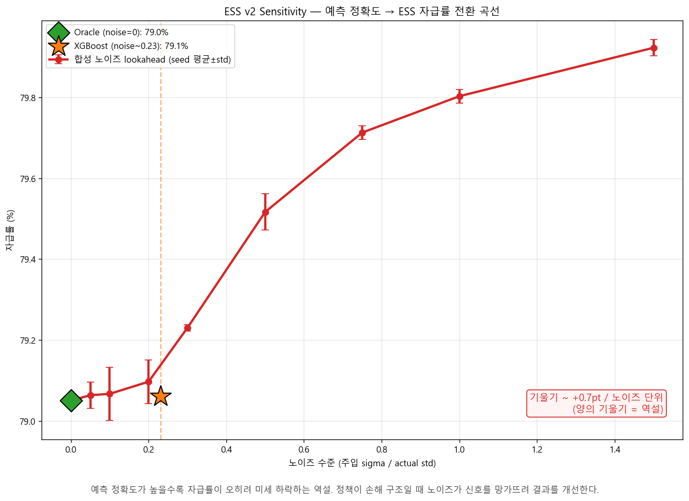

# 태양광 발전량 예측 + ESS 운영 가치 분석

전국 17개 시도의 시간별 태양광 발전량을 예측하고, 그 예측이 ESS(에너지 저장
시스템) 운영에 실제로 얼마나 가치를 만드는지 측정한 ML 시스템입니다.

**일반적 ML 프로젝트가 "예측 정확도(MAE)"에서 끝나는 것과 달리, 본 프로젝트는
정확도가 다운스트림 운영 가치로 전환되는지를 검증했습니다.**

---

## TL;DR — 핵심 발견

본 프로젝트의 가장 큰 결과는 모델 성능 수치가 아닌, **모델 정확도와 운영 가치가
구조적으로 분리될 수 있다**는 발견입니다.

1. **모델 성능 (Phase 1)**
   XGBoost 통합 모델로 전국 MAE 9.61 달성 (Naive 대비 +55.8%)

2. **운영 가치 측정 (Phase 1)**
   ESS 시뮬레이션에서 lookahead 정책이 naive보다 자급률 **−1.4pt 악화**.
   Oracle(완벽 예측)조차 같은 결과.

3. **Sensitivity 분석 (Phase 1)**
   예측 노이즈 0~150% 변화에도 자급률 곡선이 평평하거나 **음의 기울기**
   (정확도가 높을수록 미세하게 손해).

4. **원인 분석 (Phase 1)**
   그리디 시뮬 구조에서는 SOC 범위를 좁히는 어떤 정책도 손해.
   진짜 예측 가치 실현엔 **MPC(Model Predictive Control)** 필요.

5. **결론**
   "예측 정확도 향상이 운영 가치로 자동 전환되지 않는다"를 27개 시뮬 점으로
   정량 입증. 다음 단계는 모델 개선이 아닌 시스템 개선.



*예측 정확도(노이즈) 변화에도 자급률 곡선이 평평하거나 음의 기울기를 보이는 역설.
정책이 손해 구조일 때 노이즈가 신호를 망가뜨려 결과를 개선한다.*

---

## 프로젝트 구조 — Phase 1 / Phase 2

### Phase 1: 예측 + 운영 가치 측정 (완료)

| 단계 | 산출물 |
|---|---|
| 데이터 전처리 | 17개 시도 시간별 발전량 + 기상 통합 |
| 피처 엔지니어링 | lag, rolling, 기상 변수, region encoding |
| 모델 학습 | Naive · XGBoost · LSTM (3종) |
| 행동 테스트 | NaN/Inf · 방향성 · 불변성 · 정확성 검증 |
| ESS 시뮬 v2 | 4 정책 × 17 지역 × 새 지표 4종 |
| Sensitivity | 9 노이즈 × 3 seed = 27 점 |
| 최종 리포트 | `outputs/national_final_report_v2.md` |

### Phase 2: MPC 도입 (계획)

본 프로젝트에서 발견한 한계를 해결하기 위한 후속 단계입니다.

- **접근**: rolling horizon LP (매 시점 N시간 앞 보고 최적화)
- **도구 후보**: cvxpy, pyomo, stable-baselines3
- **검증 가설**: Oracle MPC > XGBoost MPC > naive 의 명확한 순서 확인
- **예상 작업량**: 2~3주

---

## 모델 성능 (Phase 1)

2023년 테스트셋, 전국 17개 시도 가중 평균 기준:

| 모델 | MAE | RMSE | 피크 MAE | Naive 대비 |
|------|-----|------|----------|-----------|
| Naive (lag1) | 21.74 | 67.03 | 30.85 | — |
| **XGBoost (통합)** | **9.61** | **46.90** | **7.87** | **+55.8%** |
| LSTM (통합) | 17.82 | 67.50 | 30.71 | +18.0% |

> XGBoost가 모든 지표에서 우수해 후속 ESS 분석은 XGBoost 단일 모델로 진행.
> LSTM은 통합 시계열 학습의 한계로 채택 보류.
> 전라남도(MAE 90.04)는 발전 규모가 커 절대 오차가 큼 — 별도 분석 대상.

---

## ESS 시뮬레이션 결과 (Phase 1)

가중 평균 기준 4 시나리오 비교:

| 시나리오 | 자가소비율 | 자급률 | 평균 부족 | 사이클수 |
|---|---|---|---|---|
| naive_baseline | 68.2% | **75.9%** | 89.3 MWh | 128.3 |
| xgb_no_lookahead | 68.2% | 75.9% | 89.3 MWh | 128.3 |
| xgb_lookahead | 66.7% | 74.5% | 90.3 MWh | 119.1 |
| oracle (완벽 예측) | 66.4% | 74.2% | 90.3 MWh | 117.7 |

**해석**: 그리디 시뮬레이터는 매 시점 SOC 범위 안에서 탐욕적 최대 충방전을
수행합니다. 이 구조에서는 SOC 범위 전체(0.20–0.80)를 활용하는 naive가
이미 탐욕 최적입니다. lookahead 정책은 SOC 범위를 좁히기만 하므로 손해를
보며, Oracle도 같은 정책 구조라 마찬가지입니다.

자세한 분석은 [`outputs/national_final_report_v2.md`](outputs/national_final_report_v2.md) 참고.

---

## 의사결정 흔적 (Decision Log)

본 프로젝트의 가치는 결과 숫자가 아닌, 매 분기점에서 내린 판단입니다.

### ESS 평가 목표: (A) 학술 비교용
실제 운영값 추정(B)이 아닌 **모델 간 통제 비교**로 의도적 포지셔닝. 외부 데이터
도입 최소화, 환경 단순화 명시.

### 울산시 노이즈 격리 (G-1)
발견: 발전 비중 0.02%, ESS 용량 1.4 MWh → 수치 안정성 위험
결정: 임계 weight=0.001 도입, 단순 평균에서만 격리(17개 vs 16개 병기)
이유: 임의 제외는 일관성 원칙에 위배. 격리 + 두 기준 병기로 정직성 확보.

### 역전 현상 발견 후 정책 재설계 거부 (G-4)
발견: lookahead/oracle이 naive보다 못한 결과
결정: 정직한 수용. 정책 재설계 거부.
이유: 결과를 "맞게" 만드는 것은 (B) 방향. (A)는 결과의 의미를 정확히 해석하는 것.
   역전 자체가 "MAE ≠ ESS 점수" 가설의 정량 증거.

### MPC 도입 후속 분리
발견: 진짜 예측 가치 실현엔 MPC 필요
결정: 본 프로젝트 범위에서 제외, Phase 2로 분리
이유: 작업량 2~3주 추가 → 발견 메시지 희석. Phase 분리가 포트폴리오 가치 ↑.

---

## 데이터

- **출처**: 기상청 ASOS 시간별 관측 + 한국전력거래소 지역별 시간별 태양광 발전량
- **기간**: 2017~2023년
- **분리**: 시간 순 (train ≤ 2022년 / test = 2023년)

> 원본 데이터(`data/`)와 학습된 모델 가중치(`models/`)는 용량 문제로 저장소에
> 포함되지 않습니다. 전처리 스크립트로 재생성하거나 별도로 받아야 합니다.

---

## 프로젝트 디렉토리

```
.
├── preprocess_national.py        # 원본 → 학습용 데이터 전처리
├── src/
│   ├── features/                 # 피처 엔지니어링
│   ├── models/                   # Baseline / XGBoost / LSTM 학습
│   ├── simulation/               # ESS 시뮬레이션 (v1, v2)
│   │   ├── ess_config_v2.py      # 파라미터 모듈
│   │   ├── ess_policy_v2.py      # 정책 함수 5종
│   │   ├── ess_simulation_v2.py  # 시뮬 본체 (Phase 1 핵심)
│   │   └── ess_sensitivity_v2.py # sensitivity 분석
│   ├── diagnostics/              # 데이터 진단 / 분포 변화 점검
│   ├── reporting/                # 지표 산출 / 최종 보고서 생성
│   ├── tests/                    # 행동 테스트
│   ├── visualization/            # 비교 그래프
│   └── utils/                    # 한글 폰트 설정 등
├── outputs/                      # 평가 결과 (json / csv / png / 보고서)
│   ├── national_final_report_v2.md    # ← 최종 리포트
│   ├── ess_v2_sensitivity_curve.png   # ← 시그니처 시각화
│   └── ...
├── archive/                      # 종료된 실험 기록
├── eda/                          # 탐색적 데이터 분석
└── requirements.txt
```

---

## 설치 및 실행

Python 3.11 기준입니다.

```bash
# 가상환경 생성 및 의존성 설치
python -m venv .venv
.venv\Scripts\activate        # Windows
pip install -r requirements.txt
```

데이터를 `data/raw/`에 배치한 뒤 파이프라인을 순서대로 실행:

```bash
# 1. 전처리
python preprocess_national.py

# 2. 피처 엔지니어링
python src/features/feature_engineering_national.py

# 3. 모델 학습
python src/models/baseline_naive_national.py
python src/models/train_xgboost_national.py
python src/models/train_lstm_national.py

# 4. ESS 시뮬레이션 v2 (Phase 1 핵심)
python -m src.simulation.ess_config_v2
python -m src.simulation.ess_policy_v2
python -m src.simulation.ess_simulation_v2
python -m src.simulation.ess_sensitivity_v2

# 5. 최종 리포트
python -m src.reporting.final_report_v2
```

---

## API 서빙 (FastAPI)

학습된 XGBoost 모델을 FastAPI로 노출합니다 (`app/`).

### 실행

```bash
# (선택) 운영용 API Key 설정
export SOLAR_API_KEY="your-strong-random-key"   # Windows: set SOLAR_API_KEY=...

# 서버 기동
uvicorn app.main:app --host 0.0.0.0 --port 8000
```

미설정 시 개발용 기본키 `dev-key-change-me`로 동작하며 시작 시 경고 로그가
출력됩니다. 운영 배포 전 반드시 환경변수를 통해 교체하세요.

### 엔드포인트

- `GET /` · `GET /health` — 메타/헬스
- `POST /predict` — 단일 (region, timestamp) 발전량 예측
- `POST /predict_batch` — 최대 1000건 배치 예측 (XGBoost 추론은 스레드풀에서 실행)
- `POST /predict_horizon` — `start_time`부터 horizon(1~48)시간의 발전량을 재귀
  multi-step 방식으로 예측 (t+1 예측값을 t+2의 lag로 사용). 입력은 직전 24시간
  실측 발전량 + 미래 N시간 기상 예보. MPC 등 미래 구간을 한 번에 받아야 하는
  다운스트림 정책 솔버용. (스레드풀 실행)

Swagger UI는 `http://localhost:8000/docs`, ReDoc은 `http://localhost:8000/redoc`
에서 확인할 수 있습니다.

본 API는 학습 모델이 24개 피처를 입력으로 사용함에 따라, 클라이언트가
원시 기상 6개(기온/강수량/습도/일조/일사량/전운량)와 시간/지역, 그리고
직전 시점들의 lag/rolling 통계를 함께 제공해야 합니다. 실서비스에서는
기상청 API + 자체 발전 이력 DB와 결합해서 사용하는 것을 가정합니다.

요청 페이로드의 정확한 필드와 검증 범위는 Swagger UI 또는
[`app/schemas.py`](app/schemas.py)를 참고하세요. 한글 컬럼명(`기온` 등)과
영문 변수명(`temperature` 등) 모두 alias로 허용됩니다.

### 호출 예시

curl로 보낼 때 `@file` 형식은 일부 환경에서 chunked transfer로 전송되며
FastAPI의 일부 검증 오류 경로가 400 Bad Request로 응답될 수 있습니다.
**urllib / `requests` 사용을 권장**합니다.

```python
import requests

payload = {
    "timestamp": "2023-07-15T13:00:00",
    "region": "전라남도",
    "기온": 28.5, "강수량": 0.0, "습도": 65.0, "일조": 0.9,
    "irradiance": 3.0, "전운량": 2.0,
    "lag_1h": 120.0, "lag_2h": 110.0, "lag_3h": 95.0, "lag_24h": 130.0,
    "power_diff_1h": 10.0, "power_diff_2h": 25.0,
    "rolling_mean_3h": 108.3, "rolling_mean_6h": 95.5, "rolling_std_3h": 12.7,
}
r = requests.post(
    "http://localhost:8000/predict",
    headers={"X-API-Key": "dev-key-change-me"},
    json=payload,
)
print(r.status_code, r.json())
# 200 {'predicted_power_mwh': 129.23..., 'region': '전라남도', ...}
```

소형 페이로드의 curl 예시도 동작합니다:

```bash
curl -X POST http://localhost:8000/predict \
  -H "Content-Type: application/json" \
  -H "X-API-Key: dev-key-change-me" \
  -d '{...위와 동일한 JSON...}'
```

#### `/predict_horizon` 호출 예시

```python
import requests
from datetime import datetime, timedelta

start = datetime(2023, 7, 15, 13, 0, 0)
history = [
    {"timestamp": (start - timedelta(hours=24-i)).isoformat(),
     "power_mwh": 100.0 + i}
    for i in range(24)
]
forecast = [
    {"timestamp": (start + timedelta(hours=i)).isoformat(),
     "irradiance": 2.5, "기온": 28.0, "강수량": 0.0,
     "습도": 60.0, "일조": 0.8, "전운량": 3.0}
    for i in range(24)
]
r = requests.post(
    "http://localhost:8000/predict_horizon",
    headers={"X-API-Key": "dev-key-change-me"},
    json={
        "region": "전라남도",
        "start_time": start.isoformat(),
        "horizon": 24,
        "history": history,
        "forecast": forecast,
    },
)
print(r.status_code, len(r.json()["predictions"]))
# 200 24  — 길이 horizon짜리 [{timestamp, predicted_power_mwh, step}, ...]
```

### 회귀 테스트

`pytest app/tests/test_api.py -v` 로 16개 회귀 테스트가 통과해야 합니다
(단일/배치 8개 + horizon 8개).
특히 `test_predict_snapshot`은 학습 CSV에서 5행을 샘플링해 raw `model.predict()`
결과와 API 경로의 결과가 **|diff| < 1e-4** 안에 들어오는지 검증합니다 —
"API 경로로 예측해도 학습 모델과 같은 답을 낸다"의 항상 검증되는 보증입니다.
horizon 테스트는 입력 검증(길이/timestamp 연속성/region/API Key)과 정상 경로의
예측 형식·길이를 함께 봅니다.

---

## 운영 모니터링 회고

본 프로젝트는 학술/포트폴리오 범위라 실제 모니터링 인프라는 구성하지 않았지만,
실서비스 배포 시 추가했을 항목을 명시합니다.

### 추가할 모니터링 항목

- **응답 시간 p95/p99 모니터링** — `RequestLoggingMiddleware`의 ms 로그를
  Prometheus histogram으로 승격
- **예측 분포 드리프트** — 일별 predicted_power_mwh 분포를 학습 시점 발전량
  분포와 KS-test/PSI로 비교
- **입력 피처 분포 드리프트** — 특히 기상 6변수(기온/강수량/습도/일조/일사량/전운량)
  의 평균·분산이 학습 분포에서 벗어나는지 감시
- **`feature_names` 검증 실패 알림** — 이번 2단계에서 발견한 "JSON과 모델의
  피처 셋 불일치" 사고를 자동 감지하기 위해, 모델 재배포 시 lifespan의
  `booster.feature_names == FEATURE_ORDER` 체크를 CI에서도 동일하게 실행

### 피드백 루프

- 실패 사례(500, 클라이언트 보고 이상 예측)를 별도 테이블에 적재하고,
  재학습 데이터로 회수합니다 — 4단계(운영) → 2단계(데이터/학습)의 닫힌 사이클.
- 본 프로젝트는 사용자 직접 입력이 아닌 기상청 API/자체 발전 이력 DB에서
  입력을 받는 구조이므로 사용자 단의 피드백 수집은 해당 없습니다.

### 본 단계에서 학습한 교훈

**모델 입출력 명세의 진실의 원천은 학습 스크립트와 모델 파일이지,
별도 JSON 문서(`feature_list_national.json`)가 아니다.** 2단계에서 모델은
24개 피처를 기대했는데 JSON은 18개만 명시하고 있었음 — 학습 코드의
`train.columns - NON_FEAT` 산출 결과만이 권위 있는 컬럼 셋입니다.
`app/config.py::FEATURE_ORDER`는 이 사실을 코드에 박은 결과이며,
lifespan에서 `booster.feature_names`와 동일성을 검증해 재발을 막습니다.

---

## 모델링 규칙

재현성과 데이터 누수 방지를 위해 다음을 강제합니다:

- **시간 순 분리**: train ≤ 2022년, test = 2023년. random split 금지.
- **데이터 누수 금지**: scaler·LabelEncoder는 train 기준으로만 fit.
- **재현성**: `random_state=42` 고정. sensitivity는 [42, 123, 456] 다중 seed.
- **야간 클리핑**: 00~05시, 19~23시 예측값은 0으로 클리핑.
- **인코딩**: CSV 입출력은 `utf-8-sig` / `utf-8`.

---

## 기술 스택

pandas · numpy · scikit-learn · XGBoost · PyTorch · matplotlib · seaborn ·
statsmodels · wandb

---

## 자세한 분석

전체 분석과 시각화는 [`outputs/national_final_report_v2.md`](outputs/national_final_report_v2.md) 참고.