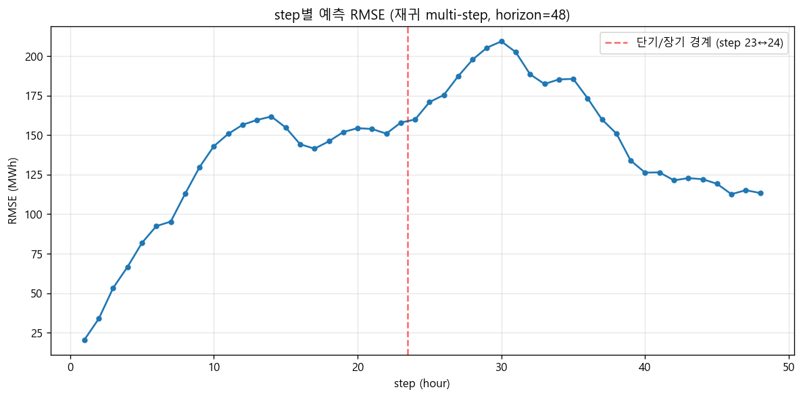
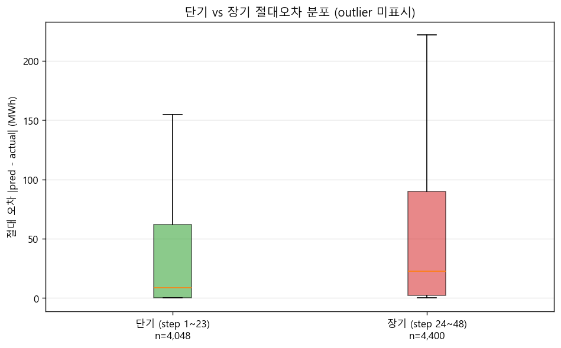
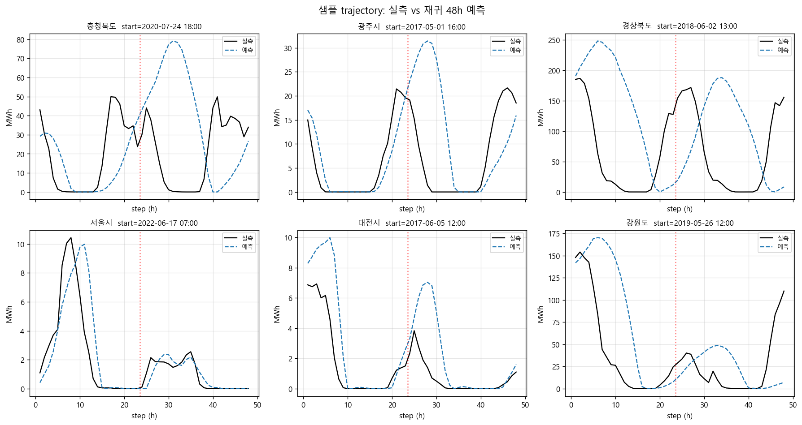

# 48h 재귀 multi-step 예측 정확도 진단 보고서

_생성: 2026-05-25 22:59:05_  
_실행 시간: 537.6s_

## 목적

round 2-2 운영자 대시보드용 MPC 오케스트레이터가 매 시점 24h lookahead 윈도우를
사용한다. 시뮬 끝 시점에서도 lookahead가 가능하려면 미래 데이터 48h가 필요한데,
재귀 multi-step의 본질상 t+24~t+47 구간 예측 품질이 t+1~t+23보다 떨어질 수 있다.
본 진단은 단기/장기 오차 비율을 측정하여 (b-1) 48h 슬라이스 방식의 정당성을 판정한다.

## 방법

- 데이터: `data/processed/national_train_features.csv` (학습 CSV)
- 샘플링: region별 균등, 총 200개 (seed=42)
- 호출: `http://localhost:8000/predict_horizon` (horizon=48)
- forecast 기상값: 학습 CSV의 ex-post 실측 (모델 자체 오차만 분리 측정)
- MAPE 계산: |actual| ≥ 1.0 MWh 시점만 사용

## 결과 요약

- 성공 샘플: **176 / 200** (실패 0, 성공률 88.0%)
- 최종 평결: **PASS**

> 장기/단기 RMSE 비율 1.24 → (b-1) 48h 슬라이스 방식이 정당함. round 2-2 진행 가능.

### 단기 vs 장기 오차

| 구간 | RMSE (MWh) | MAE (MWh) | MAPE (%) | n_points | n_points_MAPE |
|---|---:|---:|---:|---:|---:|
| 단기 (step 1~23) | 129.6553 | 57.0428 | 628.60 | 4,048 | 2,426 |
| 장기 (step 24~48) | 161.3124 | 77.6621 | 697.31 | 4,400 | 2,629 |
| **장기/단기 비율** | **1.244** | **1.361** | **1.109** | — | — |

## 시각화

## 결론

**[PASS]** 장기/단기 RMSE 비율 1.24 → (b-1) 48h 슬라이스 방식이 정당함. round 2-2 진행 가능.

## 생성물

- JSON: `outputs\diagnostics\horizon_accuracy.json`
- step별 RMSE: `outputs\diagnostics\step_wise_rmse.png`
- 오차 분포: `outputs\diagnostics\error_distribution_compare.png`
- 샘플 trajectory: `outputs\diagnostics\sample_trajectories.png`