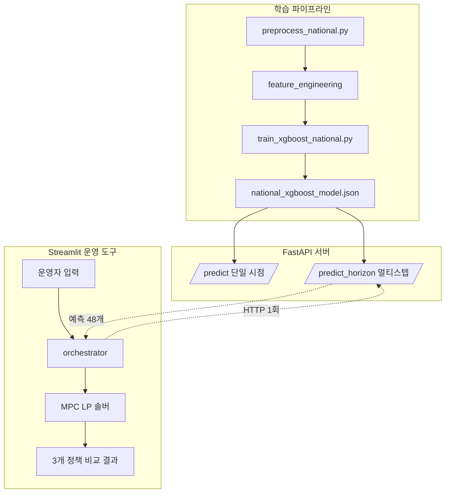

# Round 2-5: 포트폴리오 README 작성

## 배경

전체 프로젝트가 거의 마무리됐다. 이제 면접관/리뷰어가 GitHub 첫 화면에서 흡수할 **단일 README.md**를 작성한다.

- **대상**: AI 엔지니어링 포지션 면접관/리뷰어
- **흡수 시간**: 3~5분 안에 핵심 가치 전달
- **톤**: 엔지니어링 톤 (마케팅/학술 톤 X)

## 메시지 — 한 줄

> ESS 운영의 진짜 가치는 모델 정확도가 아니라 시스템 구조에 있다. 17지역 × 6개 정책 × 1년치 실증.

이 메시지가 README 첫 화면에서 즉시 전달돼야 한다.

## 작업 내역

### (a) 정보 수집 (작성 전 필수)

README 작성 전, 다음 정보를 먼저 확인하고 보고:

1. **기존 README가 있는지** — `README.md`, `README_*.md` 등. 있으면 그 내용 요약.
2. **outputs/ 디렉토리의 시각화 자산**:
   - `outputs/ess_v2_comparison.png` — 4정책 비교 (필수, README A)
   - `outputs/ess_v2_region_breakdown.png` — 지역별 분해
   - 그 외 `outputs/**/*.png`, `outputs/**/*.svg` 어떤 시각화들이 있는지 목록화
3. **현재 디렉토리 구조** — 상위 2단계까지 (`tree -L 2` 또는 `find . -maxdepth 2 -type d`)
4. **주요 산출물 파일**:
   - `outputs/ess_v2_simulation_results.json` 존재 여부
   - 학습된 모델 (`models/*.json`, `*.pkl`)
   - Streamlit 스크린샷 (`outputs/streamlit_screenshots/` 있다면 활용)

위 정보를 한 번에 stdout으로 보고한 후, 사용자 확인 받고 (b)로 진행.

### (b) README.md 작성

다음 구조로 작성. **이 구조 그대로 따를 것** (순서/섹션 명 임의 변경 금지).

#### 섹션 1: 헤더 + 한 줄 요약

```markdown
# [프로젝트 이름]

> ESS 운영의 진짜 가치는 모델 정확도가 아니라 시스템 구조에 있다.
> 17지역 × 6개 정책 × 1년치 실증.
```

프로젝트 이름은 기존 레포 이름 (`energy-time-series-forecast`) 활용 또는 적절히 명명. "태양광 ESS 운영 정책 비교 시스템" 정도가 적절.

#### 섹션 2: 핵심 발견 (전면 박스)

두 가지 시그니처 발견을 한 곳에 배치:

**시그니처 1: 모델 정확도의 한계 효용 ≈ 0**
- `mpc_xgb` (MAE 9.61) vs `mpc_oracle` (실측 = 완벽 예측)의 net_revenue 차이가 +0.08%에 불과
- AutoGluon v1/v2에서 트랜스포머 4개를 추가했지만 앙상블 가중치 0%
- Phase 1 노이즈 sensitivity에서 정확도 증가가 자급률을 오히려 떨어뜨림

**시그니처 2: MPC가 ESS 사용 목적 자체를 바꿈**
- 기존 정책: ESS = 수요 충당 도구
- MPC: ESS = 차익거래 자산 (TOU 가격 스프레드 활용)
- `mpc_xgb` is `xgb_lookahead` 대비 **net_revenue +49.53% / 자급률 -17.48pt**
- ESS 거래량 70~80% 증가

여기에 시각화 1장 (`outputs/ess_v2_comparison.png` 활용). 한 그래프로 두 시그니처가 모두 보이게 캡션 작성:
> 6개 정책 비교. MPC 도입으로 net_revenue가 +49.53% 증가하지만 자급률은 -17.48pt 떨어진다. 같은 MPC 안에서 xgb 예측과 oracle 실측의 차이는 0.08%에 불과 — 모델보다 시스템 구조가 결과를 결정함.

#### 섹션 3: 발견의 흐름 — 어떻게 여기까지 왔나

연대기적 서술. 각 단계 4~7줄. 발견과 결정이 명시되는 형태.

**단계 1: 모델 탐색기**
- 베이스라인: Naive (lag1)
- XGBoost 통합 모델: MAE 9.59, Naive 대비 20.2% 개선
- LSTM 시도: MAE 17.82 (XGBoost의 1.9배)
- **부가 발견**: LSTM의 ESS 부족횟수가 XGBoost보다 17% 적었음 → 시뮬레이터 자체를 의심 → 비대칭 분기 버그 발견 (예측이 양수인데 실측이 음수일 때 부족 카운트 누락)
- AutoGluon v1/v2로 검증: 트랜스포머 4개(TFT, PatchTST 등) 추가했으나 앙상블 가중치 0%
- 분리 학습 시도: MAE는 악화, ESS 점수는 0% 변화 → 폐기
- **결론**: XGBoost 통합 모델 정착. 트리 모델이 본 데이터(known_covariates 의존성 큰 태양광)에 가장 적합

**단계 2: ESS 시뮬레이터 정밀화**
- 17지역 차등 가중치 (전남 0.301, 울산 0.0002)
- 시간대별 수요 패턴 (KPX 표준 부하 곡선)
- 산업 통상값 도입 (0.25C 충방전 속도, RTE 90%)
- 비대칭 버그 수정: 분기와 강도 분리 ("우산을 펴는 행위는 실제 비 올 때만, 예측은 우산 크기만 결정")
- 정책 함수 분리 (naive / lookahead / perfect_foresight)
- **첫 시그니처 1 실증**: 노이즈 0→1.5 증가 시 자급률 79.05% → 79.92% (오히려 개선)
- **결론**: "정확한 예측 = 좋은 운영"이라는 가설을 반박. 그리디 시뮬에서는 예측이 가치를 못 만듦

**단계 3: TOU 변동요금 도입**
- 한전 산업용(을) 고압A 선택Ⅱ 단가 매트릭스 (2023.5.16 시행본)
- 자급률 vs net_revenue 분기 발생
- **발견**: lookahead의 의도치 않은 차익거래 — SOC 상한을 낮춰 충전을 미루는 효과가 결과적으로 max_peak 시간 매도와 off_peak 시간 매수 스프레드를 발생시켜 net_revenue +70억원
- 메시지: 같은 데이터에서 평가 지표만 바꿔도 결론이 갈린다

**단계 4: MPC 도입 — 시스템 구조 자체를 바꿈**
- 6개 정책 비교: naive / xgb_no_lookahead / xgb_lookahead / oracle / **mpc_xgb** / **mpc_oracle**
- MPC 방식: 매 시점 24시간 미래 예측 → LP(선형계획법)로 최적 충방전 시퀀스 → 첫 액션만 실행 (Rolling Horizon)
- 핵심 결과: `mpc_xgb` vs `xgb_lookahead`에서 **net_revenue +49.53% / 자급률 -17.48pt**
- **시그니처 1 재확인**: `mpc_xgb` ≈ `mpc_oracle` (차이 +0.08%) — MPC가 예측 부정확성에 robust
- **시그니처 2 발견**: MPC는 ESS를 차익거래 자산으로 재정의. 거래량 70~80% 증가
- LP infeasibility 13%는 전국 합산 케이스에서만 발생 → 시뮬 한계로 보고서에 명시

**단계 5: 운영 시스템화**
- FastAPI `/predict` 엔드포인트 + `/predict_horizon` (multi-step, horizon 1~48)
- **부가 발견**: 24-피처 불일치를 Swagger UI 첫 호출에서 발견. JSON 메타 파일이 학습 코드와 어긋남. → fail-fast 안전장치 박음 (`booster.feature_names == FEATURE_ORDER` startup 검증)
- 메시지: API 한 겹이 모델 검증으로 작동했다
- 재귀 multi-step 정당성 검증: 장기/단기 RMSE 비율 1.24 (PASS)
- Streamlit + MPC 오케스트레이터: 단일 진입점 `run_mpc_simulation()` → 3개 정책 결과 dict
- 운영자가 region, initial_soc, start_time 선택하면 3개 정책 비교 그래프

#### 섹션 4: 시스템 아키텍처

다이어그램 1장 + 짧은 설명.

다이어그램 후보:
- 옵션 A: 이미 outputs/에 있는 PNG 활용
- 옵션 B: Mermaid 다이어그램 (GitHub 자동 렌더링)

→ **Mermaid 권장**. 텍스트 기반이라 유지보수 좋고, 색상/구조도 README 톤에 맞춤. 다음과 같은 구조:



설계 결정 한 단락:
- **예측은 API로 분리** — 향후 다른 클라이언트 (모바일, 모니터링)에서도 호출 가능
- **MPC는 Streamlit 내부 구동** — 운영 파라미터를 화면에서 실시간 조절하므로 HTTP 오버헤드 제거
- **단일 진입점 `run_mpc_simulation()`** — 화면 로직과 시뮬 로직 명확 분리

#### 섹션 5: 운영 도구

Streamlit 스크린샷 1장 (있다면 `outputs/streamlit_screenshots/` 활용, 없으면 이 섹션은 한 단락 텍스트 설명만).

설명:
- region 선택 + initial_soc 슬라이더 + 시작 시점 선택 → "실행" 클릭
- 3개 정책(기본 운영 / 단기 예측 기반 / 수익 최적화 MPC)의 24시간 시뮬 결과
- 차트 4종: 발전량 예측 vs 실측 / 정책별 SOC 추이 / 순수익·자급률 비교 / 시간대별 매매
- 운영자가 자급률 우선/수익 우선 선택 가능

#### 섹션 6: 기술 스택

짧은 목록:
- **모델링**: XGBoost, AutoGluon (검증용)
- **시뮬레이터**: 자체 구현 (정책 함수 분리 구조)
- **MPC**: scipy.optimize.linprog (LP solver)
- **API**: FastAPI, Pydantic
- **UI**: Streamlit, matplotlib
- **테스트**: pytest (단위 + 회귀 + 정합성)

#### 섹션 7: <details> 접힌 섹션들

기본은 접혀 있고 클릭 시 펼침. GitHub `<details><summary>` 활용.

```markdown
<details>
<summary>실행 방법</summary>

[venv 활성화, requirements 설치, uvicorn/streamlit 실행 방법]

</details>

<details>
<summary>디렉토리 구조</summary>

[주요 디렉토리 트리]

</details>

<details>
<summary>모델 탐색 상세 (AutoGluon v1/v2, LSTM 등)</summary>

[AutoGluon v1/v2 검증 내용, LSTM 실패 원인 분석, 트랜스포머 시도 결과]

</details>

<details>
<summary>핵심 발견 상세 — MAE ≠ ESS 점수</summary>

[충남 case, LSTM vs XGBoost 비대칭 버그 추적 등]

</details>
```

### (c) 작성 시 톤 가이드라인

- **마케팅 톤 금지**: "혁신적인", "최첨단", "완벽한" 등 X
- **학술 톤 금지**: "본 연구는", "사료된다" 등 X
- **엔지니어링 톤**: "이런 문제가 있어서 이렇게 풀었고 결과는 이랬다" 직설적
- **숫자 명시**: 막연한 표현 대신 구체적 수치 ("크게 개선됨" → "+49.53%")
- **트레이드오프 명시**: 좋은 점만 적지 말고 잃은 것도 함께 ("순수익 +49.53%, 자급률 -17.48pt")
- **실패한 시도도 가치**: AutoGluon 트랜스포머 0% 가중치, 분리 학습 폐기, LSTM 17.82 등 솔직하게

### (d) 작성 시 분량 가이드라인

- **본문 (펼쳐진 부분)**: 1500~2500자
- **시각화 포함 스크롤**: 1~2번
- **<details> 안 내용**: 제한 없음 (관심 있는 사람만 봄)

## 검증

작성 후 다음 체크:

1. **첫 5초 안에 메시지 전달되나**: 헤더 + 한 줄 요약 + 시그니처 1+2 박스만 봤을 때 "이 프로젝트가 뭔지" 파악되는가
2. **숫자가 막연하지 않은가**: 모든 핵심 주장에 구체 수치 첨부
3. **흐름이 자연스러운가**: 단계 1~5가 "결정 → 발견 → 다음 결정" 형태로 이어지는가
4. **시각화가 메시지를 받쳐주는가**: 그래프 캡션이 본문과 호응하는가
5. **<details> 안 내용이 흐름에 끼지 않는가**: 펼치지 않아도 본문이 완결되는가

## 주의사항

- **기존 README가 있으면 무조건 백업**: `README.md.bak`으로 복사 후 새로 작성
- **outputs/ 시각화 경로 정확히 확인**: README에서 참조할 PNG가 실제로 존재하는지 작성 전 검증
- **마크다운 렌더링 확인**: GitHub에서 Mermaid가 잘 렌더되는지 (자동 지원이지만 문법 에러 있으면 깨짐)
- **사용자 검증을 위한 정보 제공**: 작성 완료 후 stdout에 README의 첫 3섹션 (헤더, 시그니처 박스, 발견의 흐름 단계 1까지)을 그대로 출력. 사용자가 톤/메시지 확인 가능하게.
- **자의적 사실 추가 금지**: 노트에 없는 수치, 발견, 의사결정을 만들어내지 말 것. 모호하면 표시 (TODO 등) 후 사용자 확인 받기

## 끝나면 알려줄 것

1. (a) 정보 수집 결과 (기존 README, 시각화 자산, 디렉토리 구조)
2. README.md 최종 분량 (글자 수 또는 줄 수)
3. 사용한 시각화 자산 목록 (경로)
4. <details> 섹션 개수와 각 제목
5. 자의적으로 채운 부분이 있다면 명시 (사용자 확인 필요)
6. 막힌 부분 / 이상한 부분
